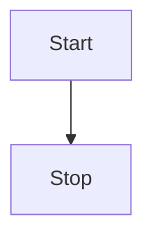

<script setup>
import {ref} from 'vue'
const total = ref(0)
</script>

This endpoint lets you retrieve all forms.

`GET https://api/v1/forms`

#### Query parameters

- page - Current page of forms **default 1**
- page_size - Page size of payload max 100 **default 25**

---

Another thing

---

## Complex Anchor

```json
{
  "forms": [
    {
      "id": "formid1",
      "name": "Form title 1"
    },
    {
      "id": "formid2",
      "name": "Form title 2"
    }
  ],
  "page": "1",
  "page_size": "25"
}
```



{{total}}

<button @click="total++">inc</button>
