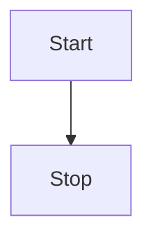
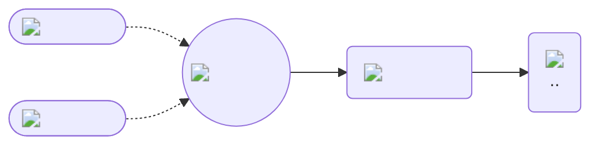

## Introduction

Before you can start making API calls, you need to create your personal access token.

1. Go to your [token page](https://api/api-tokens)

2. Create your token and save it

::: danger

Be careful once you close the window with token you are not able to see it again!

:::




<!--  -->
---



<!-- ```mermaid
mindmap
Root
    A
      B
      C
``` -->

<style>
  #git {
    border-radius: 50px;
  }

  #helm,
  .dark #git{
    transform: scale(1.5);
  }

  .dark #helm {
    filter: brightness(1.5);
  }
</style>
